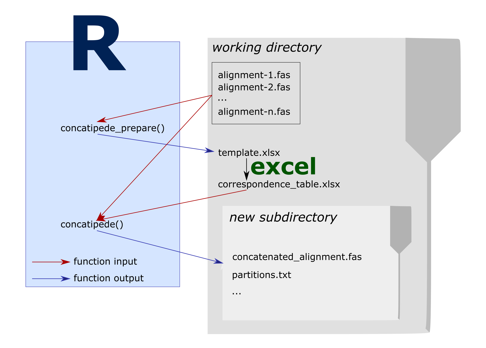

```{r, include = FALSE}
knitr::opts_chunk$set(fig.align = "center")
options(scipen = 6, width = 85)
```

# Concatipede requirements and workflow

This package needs to have the alignments to concatenate in fasta files all placed in the working directory. Only fasta files to concatenate should be present in the working directory. If other fasta files are present and you don´t want to include them, see the `concatipede_prepare(exclude = "")` option.



# How to use concatipede

## Prepare the files

You should put all the fasta files of interest in a target work directory. Here, in order for this example to work, we first set up a `concatipede_test/` directory and place some example fasta files shipped with the package in it.

```{r results = "hide"}
# Create a directory to put the fasta files for this example
dir.create("concatipede_test")
# Set it as the working directory
setwd("concatipede_test")
# Copy the example fasta files shipped with the package into that directory
example_files = list.files(system.file("extdata", package="concatipede"), full.names = TRUE)
file.copy(from = example_files, to = getwd())
```

Now all the data used in this vignette is present in the working directory.

## Set up the template for the correspondence table

The first step is to generate a template correspondence table with all the sequence names. You can do this with the function `concatipede_prepare()`.

But first let's check what fasta files are in our directory:

```{r }
list.files(pattern = "\\.fas")
```

Those are alignments for 4 markers of tardigrades from the family Macrobiotidae.
With the function `concatipede_prepare()` we will generate an excel table with the sequence names in the order they are found in each alignment.

```{r }
library(concatipede)
concatipede_prepare()
```

Once it is done, an excel file should be saved in your working directory. The template excel file looks like this:

```{r, echo=FALSE, results="hide", message=FALSE, warning =FALSE}
# load the libraries without having any message printed
library(DT)
library(tidyverse)
```

```{r, echo=FALSE}
readxl::read_xlsx("seqnames.xlsx",sheet=1,col_names=T)%>%
  datatable(extensions = 'Buttons',
            options = list(dom = 'Blfrtip',
                           rownames= F,
                           scrollX=TRUE,
                           buttons = c('excel'),
                           lengthMenu = list(c(nrow(.),25,50,-1),
                                             c(nrow(.),25,50,"All"))))
```

## Modify the correspondence table

Modify the generated excel correspondence table to reflect how you want to concatenate the sequences in the different alignments. It is important that the first cell of the first row (**name**) is not modified and the other column names are the filenames of the fasta alignments. In the **name** column you must set the name of the concatenated sequences.

You can copy and save different versions of the correspondence table in different sheets of the excel file, they can be then selected with the specific option.

The first sheet of the example excel file now looks like this:
```{r, echo=FALSE}
readxl::read_xlsx("Macrobiotidae_seqnames.xlsx",sheet=1,col_names=T)%>%
  datatable(extensions = 'Buttons',
            options = list(dom = 'Blfrtip',
                           rownames = F,
                           scrollX=TRUE,
                           buttons = c('excel'),
                           lengthMenu = list(c(nrow(.),25,50,-1),
                                             c(nrow(.),25,50,"All"))))
```

## Concatenate the alignents

Now we input this excel to the `concatipede()` function:
```{r message = FALSE}
concatipede("Macrobiotidae_seqnames.xlsx", out = "Macrobiotidae_4genes", excel.sheet = 1)
```

This will create a new folder with the concatenated alignment in different formats.

Here is the concatenated alignment:
```{r, echo=FALSE, fig.width = 10, fig.height = 3}
par(mar=c(1,12,1,1))
image(concatipede("Macrobiotidae_seqnames.xlsx",out="Macrobiotidae_4genes",excel.sheet = 1,return.aln=T),cex=0.5)
```

We can also choose only a subset of the taxa from a correspondence table saved as separate sheet in the excel file.
```{r, echo=FALSE}
readxl::read_xlsx("Macrobiotidae_seqnames.xlsx",sheet=2,col_names=T)%>%
  datatable(extensions = 'Buttons',
            options = list(dom = 'Blfrtip',
                           rownames = F,
                           buttons = c('excel'),
                           scrollX=TRUE,
                           lengthMenu = list(c(nrow(.),25,50,-1),
                                             c(nrow(.),25,50,"All"))))
```

```{r }
concatipede("Macrobiotidae_seqnames.xlsx",out="Macrobiotus_4genes",excel.sheet = 2)
```

```{r, echo=FALSE, fig.width = 10, fig.height = 1.5}
par(mar=c(1,12,1,1))
image(concatipede("Macrobiotidae_seqnames.xlsx",out="Macrobiotus_4genes",excel.sheet = 2,return.aln=T),cex=0.5)
```

And another one but in this case we select only one marker:
```{r, echo=FALSE}
readxl::read_xlsx("Macrobiotidae_seqnames.xlsx",sheet=3,col_names=T)%>%
  datatable(extensions = 'Buttons',
            options = list(dom = 'Blfrtip',
                           buttons = c('excel'),
                           scrollX=TRUE,
                           lengthMenu = list(c(nrow(.),25,50,-1),
                                             c(nrow(.),25,50,"All"))))
```

```{r }
concatipede("Macrobiotidae_seqnames.xlsx",out="Macrobiotidae_COI",excel.sheet = 3)
```

```{r, echo=FALSE, fig.width = 10, fig.height = 3}
par(mar=c(1,12,1,1))
image(concatipede("Macrobiotidae_seqnames.xlsx",out="Macrobiotidae_COI",excel.sheet = 3,return.aln=T),cex=0.5)
```

