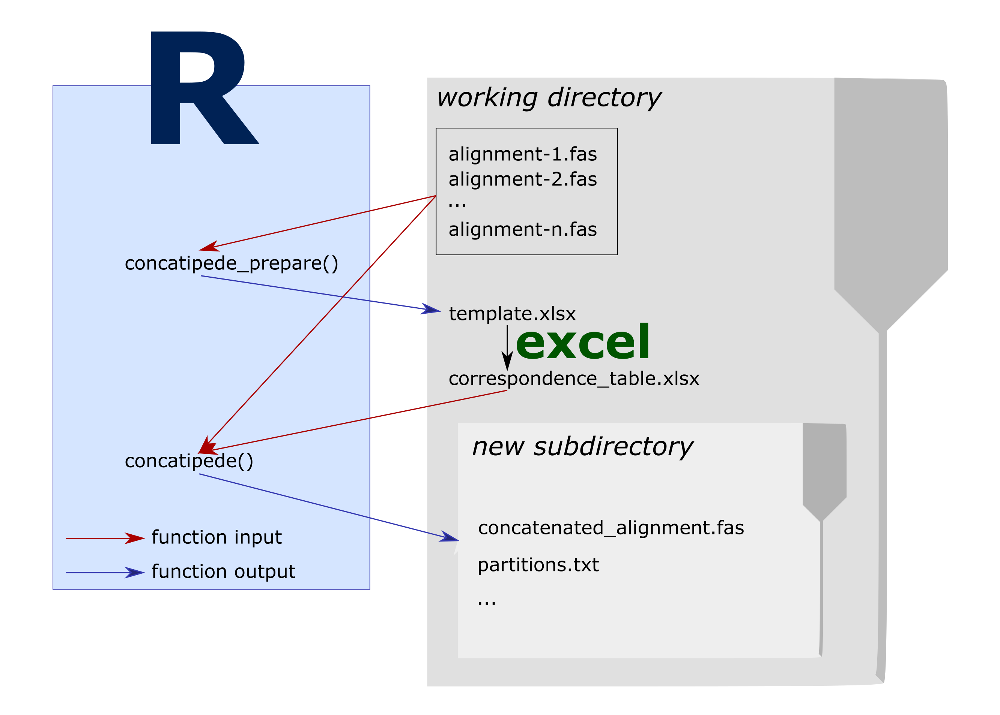

```{r, include = FALSE}
knitr::opts_chunk$set(fig.align = "center")
options(scipen = 6, width = 85)
```

# Concatipede requirements and workflow

The concatipede package allows to concatenate sequences from different Multiple Sequence Alignments (MSAs) based on a correspondence table that indicates how sequences from different MSAs are linked to each other.  

For this package to work, all the MSAs in fasta format should be placed in the same folder (that can be the working directory). Only the fasta files to be concatenated should be present in the directory. If other fasta files are present and you don´t want to include them, see the `concatipede_prepare(exclude = "")` option.



# How to use concatipede

## Prepare the files

All the fasta files of interest should be put in a target directory. Here, in order for this example to work, we first set up a `concatipede_test/` directory, copy the example fasta files shipped with the package in it and set it as working directory. The concatipede package functions automatically load and save files in the working directory, however options to direct them to different directories are present.  

```{r results = "hide"}
# Create a directory to put the fasta files for this example
dir.create("concatipede_test")
# Set it as the working directory
setwd("concatipede_test")
# Copy the example fasta files shipped with the package into that directory
example_files = list.files(system.file("extdata", package="concatipede"), full.names = TRUE)
file.copy(from = example_files, to = getwd())
```

Now all the data used in this vignette is copied in the working directory.

## Set up the template for the correspondence table

The first step is to generate a template correspondence table with all the sequence names. You can do this with the function `concatipede_prepare()`.

But first let's check what fasta files are in our directory:

```{r message = FALSE}
library(concatipede)
library(tidyverse)
find_fasta()
```

Those are alignments for 4 markers of tardigrades from the family Macrobiotidae.
With the function `concatipede_prepare()` we will generate an excel table with the sequence names in the order they are found in each alignment.

```{r }
concatipede_prepare(out = "seqnames")
```

Once it is done, an excel file should be saved in your working directory. The template excel file looks like this:

```{r, echo=FALSE, results="hide", message=FALSE, warning =FALSE}
# load the libraries without having any message printed
library(DT)
library(tidyverse)
```

[](template.png)

*(You can click on Excel screenshots to view them larger.)*

## Modify the correspondence table

Each row of the correspondence table will be used to build one concatenated sequence, by extracting and concatenating the corresponding sequences from the input files. You can modify the template excel correspondence table to reflect how you want to concatenate the sequences from the different alignments.

It is important that the first cell of the first row (cell **A1**, **"name"**) is not modified; the other column names are the filenames of the fasta alignments. In the **name** column you must set the name of the concatenated sequences.

You can copy and save different versions of the correspondence table in different sheets of the excel file: they can be selected with an appropriate option in the R session later.

After modifying the template to specify the correct matches for concatenation, the first sheet of our example excel file now looks like this:

[](edited_1.png)

<div class="alert-primary" role="alert">

<b>Note:</b> If the names of the sequences in each input file are sufficiently consistent, you can also try to use the `auto_match_seqs()` function to ask the package to perform some automatic name-matching for you (which you can still review and correct before doing the actual concatenation). See the example at the end of this vignette for more details.

</div>

## Concatenate the alignents

Now we input this excel file to the `concatipede()` function:
```{r message = FALSE}
concatipede(filename = "Macrobiotidae_seqnames.xlsx", out = "Macrobiotidae_4genes", excel.sheet = 1)
```

This will create a new subfolder with the concatenated alignment in different formats.  
Note that also a .txt file containing the start and ending positions of the different markers in the concatenated alignments is saved in the output directory.   

Here is a visualization of the concatenated alignment:
```{r, echo=FALSE, fig.width = 10, fig.height = 3, message = FALSE}
par(mar=c(1,12,1,1))
image(concatipede(filename = "Macrobiotidae_seqnames.xlsx",out="Macrobiotidae_4genes",excel.sheet = 1),cex=0.5)
```

We can also choose a subset of the taxa from a correspondence table, stored as a separate sheet in the excel file. For example, we can ask `concatipede()` to use the second sheet of the Excel file below when performing the concatenation. This sheet only contains data for the Macrobiotus taxa.

[](edited_2.png)

```{r message = FALSE}
concatipede(filename = "Macrobiotidae_seqnames.xlsx",out="Macrobiotus_4genes",excel.sheet = 2)
```

```{r, echo=FALSE, fig.width = 10, fig.height = 1.5, message = FALSE}
par(mar=c(1,12,1,1))
image(concatipede(filename = "Macrobiotidae_seqnames.xlsx",out="Macrobiotus_4genes",excel.sheet = 2),cex=0.5)
```

Here is another example in which we select only one marker, stored in the "COI" sheet of the Excel file:

[](edited_3.png)

```{r message = FALSE}
concatipede(filename = "Macrobiotidae_seqnames.xlsx",out="Macrobiotidae_COI",excel.sheet = 3)
```

```{r, echo=FALSE, fig.width = 10, fig.height = 3, message = FALSE}
par(mar=c(1,12,1,1))
image(concatipede(filename = "Macrobiotidae_seqnames.xlsx",out="Macrobiotidae_COI",excel.sheet = 3),cex=0.5)
```

# Accessory functions
Two accessory functions to help with sequence management are present in the package (`get_genbank_table()` and `rename_sequences()`).

## get_genbank_table()
This function extract the GenBank accession numbers from the sequence names in a correspondence table and return a GenBank accession table. If the function cannot find a GenBank accession number in the sequence name it will return a NA.  

It accepts both a path of the excel corresponcende table or a dataframe.

```{r }
genbank.table = get_genbank_table(filename = "Macrobiotidae_seqnames.xlsx", excel.sheet = 1)
```

```{r, echo=FALSE}
get_genbank_table(filename = "Macrobiotidae_seqnames.xlsx", excel.sheet = 1) %>% datatable(extensions = 'Buttons',
            options = list(dom = 'Blfrtip',
                           rownames = F,
                           buttons = c('excel'),
                           scrollX=TRUE,
                           lengthMenu = list(c(nrow(.),25,50,-1),
                                             c(nrow(.),25,50,"All"))))
```


## rename_sequences()
This function renames the sequences in the provided fasta files based on a correspondence table and a vector of markers names.

The new sequence names will be composed by the GenBank accession number (if present), the name indicated in the correspondennce table and the marker name provided. The function creates a new directory where the renamed fasta files are saved, together with an updated correspondence table.

```{r eval = FALSE}
rename_sequences(filename = "Macrobiotidae_seqnames.xlsx", excel.sheet = 1, marker_names = c("COI","ITS2","LSU","SSU"))
```

# Sequence names automatching  
Concatipede also includes a function that tries to automatch the sequence names from different fasta files (`auto_match_seqs()`).

If the sequence names are not "clean" the matching won't be perfect, so it is advisable to check the automatched excel file.

In the example below it is also illustrated how to use base concatipede functions to customize the template preparation, sequence names matching and concatenation:

```{r, fig.width = 10, fig.height = 3, message = FALSE}
find_fasta() %>%
  concatipede_prepare() %>%
  write_xl("template.xlsx") %>%
  auto_match_seqs() %>%
  write_xl("template_automatched.xlsx") %>%
  concatipede() %>%
  write_fasta("merged-seqs.fasta") %>%
  image(cex=0.3)
```
